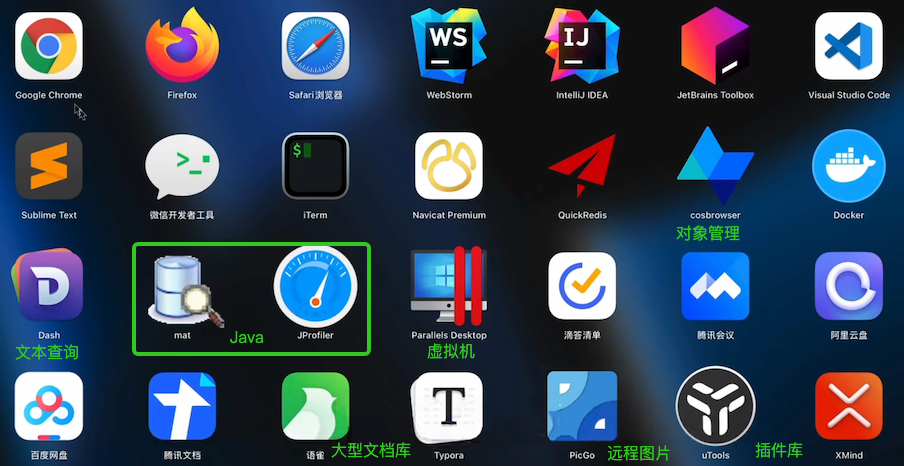

Over All Steps
===================

|index|          	|             	| content                                                                                             	|
|--- |----------	|-------------	|-----------------------------------------------------------------------------------------------------	|
| 1 | Must     	| Vpn         	| clash                                                                                               	|
| 2 | Must     	| Iterm2      	| [iterm2 Profile import](iterm2Profiles.json)<br>[oh my zsh](https://ohmyz.sh/)<br>`echo 'bindkey \^U backward-kill-line' >> ~/.zshrc`                         	|
| 3 | Must     	| ScreenSplit 	| [Rectangle](https://rectangleapp.com/) <br> [Other Suggest](https://www.v1tx.com/post/best-mac-split-screen-app/) 	|
| 4 | Must     	| Git&Python  	| [Miniconda](https://docs.conda.io/en/latest/miniconda.html) <br>[Pre-commit](https://pre-commit.com/)                                              	|
| 5 | Must     	| Develop     	| [Homebrew](https://brew.sh)<br> LibreSSL SSL_connect: SSL_ERROR_SYSCALL in connection to github.com:443  <br>[Vscode](https://code.visualstudio.com/)                                                                 	|
|6| Optional 	| SSH         	| Multiple SSH                                                                                        	|
| 7 | Suggest  	| Other       	| Alfred<br>                                                                                    	|


SSL_ERROR_SYSCALL
=====================

```bash
export https_proxy=http://127.0.0.1:7890 http_proxy=http://127.0.0.1:7890 all_proxy=socks5://127.0.0.1:7890
```
https://stackoverflow.com/questions/48987512/ssl-connect-ssl-error-syscall-in-connection-to-github-com443


Multiple SSH Keys settings for different github account
=================================================================


create different public key
---------------------------------

create different ssh key according the article [Mac Set-Up Git](http://help.github.com/mac-set-up-git/)

	$ ssh-keygen -t rsa -C "your_email@youremail.com"

Please refer to [github ssh issues](http://help.github.com/ssh-issues/) for common problems.

for example, 2 keys created at:

	~/.ssh/id_rsa_github1
	~/.ssh/id_rsa_github2

[IMPORTANT] then, add these two keys as following. 

	$ ssh-add ~/.ssh/id_rsa_github1
	$ ssh-add ~/.ssh/id_rsa_github2

you can delete all cached keys before

	$ ssh-add -D

finally, you can check your saved keys

	$ ssh-add -l


Modify the ssh config
---------------------------------

	$ cd ~/.ssh/
	$ touch config
	$ vi config

Then added

	#github1 account
	Host github.com-github1
		HostName github.com
		User git
		IdentityFile ~/.ssh/id_rsa_github1
		AddKeysToAgent yes
		UseKeychain yes

	#github2 account
	Host github.com-github2
		HostName github.com
		User git
		IdentityFile ~/.ssh/id_rsa_github2
		AddKeysToAgent yes
		UseKeychain yes


Following config used for macOS Sierra 10.12.2 or later [github SSH instruction](https://docs.github.com/en/authentication/connecting-to-github-with-ssh/generating-a-new-ssh-key-and-adding-it-to-the-ssh-agent)

	AddKeysToAgent yes
	UseKeychain yes

Clone you repo and modify your Git config
---------------------------------------------

clone your repo (change default git@github.com to git@github.com-github2)
	git clone git@github.com-github2:github2/gfs.git 

cd gfs_github2 and modify git config

``` bash
git config user.name "github2"
git config user.email "github2@gmail.com" 
```
 

or you can have global git config
``` bash
git config --global user.name "github2"
git config --global user.email "github2@gmail.com"
```

then use normal flow to push your code
``` bash
git add .
git commit -m "your comments"
git push
```

VS code env set up to include workspaceFolder
======================================================
For Error

```bash
ModuleNotFoundError: No module name 'x'

```


[Solution](https://stackoverflow.com/questions/62366211/vscode-modulenotfounderror-no-module-named-x):
Press Ctrl + Shift + P to open Command Palette
Go to Users.setting.json
Add the following line
* MacOS
```
"terminal.integrated.env.osx": { "PYTHONPATH": "${workspaceFolder}" }
```

* Windows
```
"terminal.integrated.env.windows": { "PYTHONPATH": "${workspaceFolder}" }
```

Pylint
=========
For Error `Instance of 'SQLAlchemy' has no 'Table' member (no-member)`


https://stackoverflow.com/questions/28193025/pylint-cant-find-sqlalchemy-query-member

```bash
pip install pylint-flask
pip install pylint-flask-sqlalchemy
```
``` json
"python.linting.pylintArgs": ["--load-plugins", "pylint_flask_sqlalchemy", "pylint_flask"]
```


For Error 
```
instance of SQLAlchemy has no column member
instance of SQLAlchemy has no integer member
instance of SQLAlchemy has no text member
instance of scoped_session has no add member
instance of scoped_session has no commit member
Class Registrants has no query member
```

https://stackoverflow.com/questions/42789666/pylint-error-message-on-cloud-9-cs50

needed to add in the .pylintrc file:

```
ignored-classes=SQLObject,Registrant,scoped_session
```


Nginx
========
* [install nginx](https://www.javatpoint.com/installing-nginx-on-mac)
* 编辑 Nginx 的主配置文件`/usr/local/nginx/conf/nginx.conf`你可以使用任何文本编辑器打开该文件
* 在 http 块内添加以下行，以包含 conf.d 文件夹中的所有配置文件`include /usr/local/nginx/conf.d/*.conf;`
* 检查配置文件正确性`sudo nginx -t`，重启nginx `sudo nginx -s reload`


git clone 仓库
===============
利用git从一个仓库拷贝一个项目到另一个仓库，并且log（日志记录）也能够一起过去。

注意：目标仓库可以新建一个；如果用自己曾经用过的仓库里面的文件会被覆盖

1、从原地址克隆一份裸版本库

`git clone --bare http:  //....(原始仓库地址)`
–bare 创建的克隆版本库都不包含工作区，直接就是版本库的内容，这样的版本库称为裸版本库。

2、进入克隆下来的目录

`cd project.git（project即为你的项目名称）`

3、以镜像推送的方式上传代码到新的仓库地址。
（目标仓库可以自己新建一个，如果用自己曾经用过的仓库里面的文件会被覆盖）

`git push --mirror http：//...(目标仓库地址)`